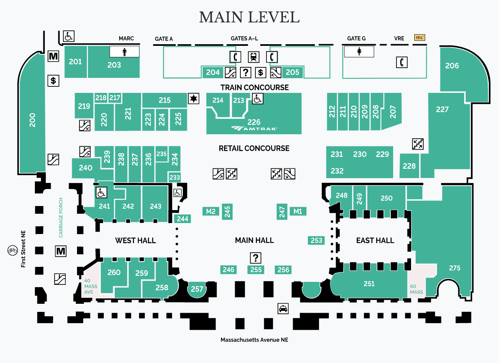

# Northeast Regional Train Guide - WAS

I could not really find this information anywhere, so I wanted to compile
it myself. I sometimes find Washington Union Station (WAS) to be very
stressful. There is not much room to wait for your train, and everybody
rushes to the gate once it is announced. Add on top of that that the lines
can wrap around out the gate area and extend through the entire concourse
and (holiday travel especially) can become quite stressful.

My goal here is to try to get information about where trains are likely to
come in. There are tracks that are terminal tracks on the left side (Gates A-F) 
and lower tracks that allow trains to continue North/South (Gates G-L). I am
pretty sure that northbound Virginia Service trains come in to G-L, and that
trains where DC is the origin come in around D-F. Knowing if your train 
originates in DC or is Virginia Service and passes through could help choose 
where to wait for the train and possibly beat the crowd.

This is sort of a stupid repo, but I want to be able to update it and share
with people, and let people collaborate if they want. I come from a software
background, so this seems like a good way to do it for me.

## Washington Union Station (WAS) Map

Source: https://www.unionstationdc.com/pdfs/directoryMap.pdf

## Trains that Originate at WAS

| Train \# | Days | Attested Gates |
|:---:|-------|---|
| 122 | Su    | |
| 124 | SaSu  | |
| 126 | Su    | |
| 130 | Mo-Fr | |
| 132 | Su    | |
| 134 | ThFr  | |
| 136 | Fr    | |
| 138 | Mo-Fr | |
| 140 | SaSu  | |
| 146 | Sa    | |
| 148 | Mo-Fr | |
| 150 | SaSu  | |
| 152 | SaSu  | |
| 154 | Su    | |
| 158 | SaSu  | |
| 160 | SaSu  | |
| 162 | SaSu  | |
| 166 | Su    | |
| 168 | Sa    | |
| 170 | Mo-Fr | |
| 172 | Mo-Fr | |
| 178 | Mo-Fr | |
| 180 | Mo-Fr | |
| 182 | Mo-Fr | |
| 184 | Mo-Fr | |
| 186 | Mo-Fr | |
| 190 | Mo-Fr | |
| 192 | Sa    | |
| 196 | Mo-Fr | |

--------------------------------------------------------

## Virginia Service

Trains that Originate South and continue thru WAS

| Train \# | Days | Attested Gates |
|:---:|-------|---|
| 66  | Daily | |
| 82  | Sa    | |
| 84  | Mo-Fr | |
| 86  | Mo-Fr | |
| 88  | SaSu  | |
| 94  | Mo-Fr | |
| 96  | Su    | |
| 156 | SaSu  | |
| 164 | SaSu  | |
| 174 | Mo-Fr | |
| 176 | Mo-Fr | |
| 194 | Sa    | |
